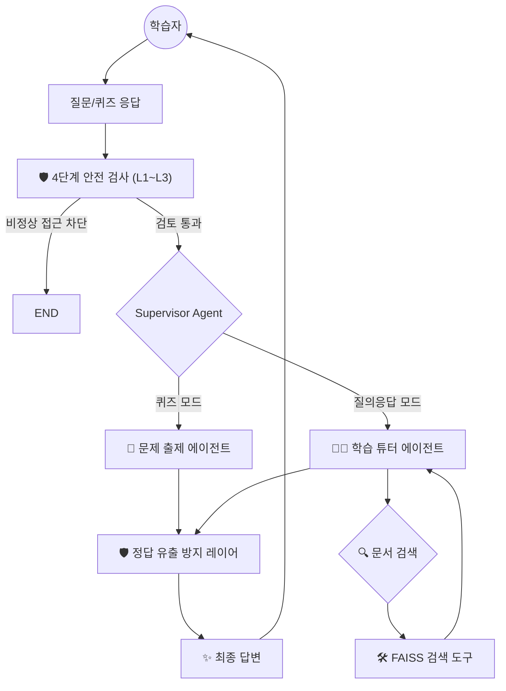

# 🧠 Learning Pacemaker: 스스로 학습 경로를 설계하는 AI 튜터

**"단순한 읽기를 넘어, 질문과 퀴즈로 완성하는 능동적 학습 시스템"**

Learning Pacemaker는 PDF 문서의 맥락을 분석하여 핵심 문제를 생성하고, RAG(검색 증강 생성) 기반의 질의응답을 통해 학습자가 지식의 빈틈을 스스로 메울 수 있도록 돕는 교육 보조 도구입니다.

---

## 🎯 프로젝트 동기
수백 페이지에 달하는 강의안이나 기술 문서를 단순히 읽기만 해서는 내용을 완벽히 소화하기 어렵습니다. 학습자가 자신이 무엇을 알고 무엇을 모르는지 메타인지적으로 파악할 수 있도록, **능동적인 지식 확인(퀴즈)**과 **안전한 문답 환경(가드레일)**이 결합된 튜터를 개발하게 되었습니다.

---

## 🏗️ 시스템 아키텍처
단순한 일방향 체인은 복잡한 상호작용을 제어하는 데 한계가 있습니다. 본 프로젝트는 **LangGraph**를 도입하여 에이전트 간의 상태를 유지하고 흐름을 명시적으로 제어합니다.



---

## 🚀 개발 중에 했던 고민들 (Key Engineering)

### 1. LangGraph 기반의 상태 관리 및 최적화
사용자의 의도에 따라 퀴즈와 일반 대화를 유연하게 오가야 하는 라이프사이클을 관리하기 위해 상태 기반의 그래프 구조를 채택했습니다.
*   **효율성**: 에이전트마다 필요한 컨텍스트(PDF 내용 혹은 대화 이력)만 선별적으로 전달하여, 불필요한 토큰 낭비를 줄이고 추론의 정확도를 높였습니다.

### 2. 가르침의 원칙을 준수하는 가드레일 (Safety)
단순히 답을 주는 AI가 아니라 '교육적 가치'를 지키는 시스템을 지향합니다.
*   **Focus Filter**: 학습과 무관한 주제(게임, 연예 등)로 대화가 새는 것을 방지하고 학습으로 복귀시킵니다.
*   **Teaching Compliance**: 퀴즈 정답을 즉시 요구하는 경우, 답을 바로 알려주는 대신 힌트를 제공하여 학습자가 직접 답을 찾도록 유도합니다.

---

## 🧪 성능 개선 및 실험 (Experiments)
*   **Chunking 전략 최적화**: 문서 검색의 품질을 결정하는 텍스트 분할 설정을 수차례 실험했습니다. `chunk_size`와 `overlap`의 상관관계를 분석하여 문맥 손실이 가장 적은 최적의 지점을 찾았습니다.
*   **모델 믹스 전략**: 응답 속도가 중요한 입출력 검증에는 가벼운 모델을, 정교한 출제가 필요한 에이전트 노드에는 고성능 모델을 배치하여 비용과 응답 품질 사이의 최적점을 찾았습니다.

---

## 🛠️ 기술 스택
- **Language**: Python 3.12
- **Orchestration**: LangChain, LangGraph
- **LLM**: Google Gemini 2.5/3.1 Flash series
- **Vector DB**: FAISS (Local)
- **Dependency Management**: uv

---

## ⚙️ 실행 방법
1. 저장소 클론 및 패키지 설치
   ```bash
   uv sync
   ```
2. 환경 변수 설정
   `.env` 파일에 `GOOGLE_API_KEY`를 등록합니다.
3. 애플리케이션 실행
   ```bash
   uv run streamlit run main.py
   ```

---
**License**: MIT
