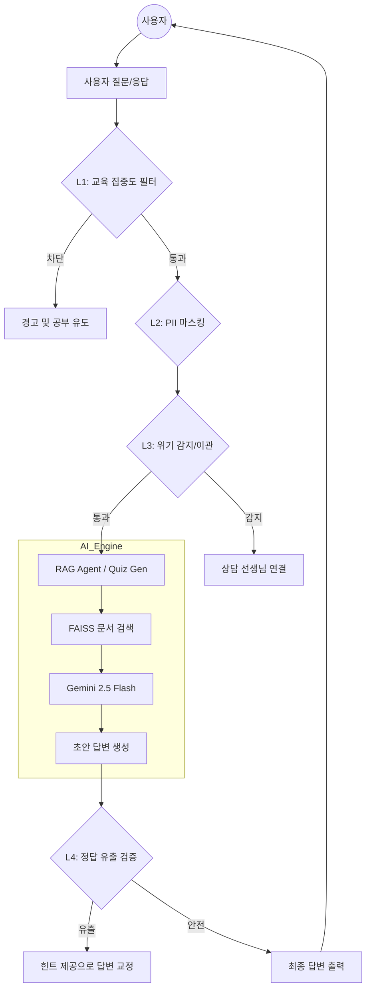

# 📖 PDF AI 퀴즈 튜터 (LangChain Quiz Chatbot)

**"지식을 묻는 것에서 끝내지 않고, 안전하게 지식을 완성하는 AI 학습 보조 시스템"**

사용자가 업로드한 PDF 문서를 분석하여 지능형 퀴즈를 생성하고, RAG(검색 증강 생성) 기반의 질의응답을 제공하는 교육용 AI 애플리케이션입니다.

---

## 🎯 문제 정의 (Problem Definition)

*   **정적인 학습의 한계**: 단순히 문서를 읽는 방식은 학습자의 이해도를 실시간으로 점검하기 어려우며, 능동적인 참여를 끌어내기에 부족합니다.
*   **AI의 신뢰성 및 안전성 문제**: 교육 환경에서 AI를 사용할 때 발생할 수 있는 환각(Hallucination), 개인정보 유출, 그리고 학습 범위를 벗어난 딴짓(Distraction)에 대한 통제 장치가 부재합니다.
*   **해결책**: 문서를 바탕으로 **스스로 문제를 출제**하고, 사용자의 질문에 **문서 근거로만 답변**하며, **4단계 다층 가드레일**을 통해 안전한 교육 환경을 보장하는 지능형 튜터를 제안합니다.

---

## 🏗️ 시스템 아키텍처 (Architecture)

본 시스템은 사용자의 입력부터 AI의 답변 출력까지 모든 과정을 미들웨어가 감시하고 제어하는 다층 방어 구조를 가지고 있습니다.



---

## ✨ 핵심 기능 (Key Features)

### 1. 지능형 퀴즈 제너레이터 (Quiz Generator)
- 문서 전체의 맥락을 분석하여 고퀄리티의 4지선다형 객관식 문제를 자동 생성합니다.
- **Decision Making**: AI가 포맷을 벗어나지 않도록 `ChatPromptTemplate`을 통해 출력을 엄격히 제한하고, 정규식 기반 파싱 로직을 도입하여 시스템 안정성을 높였습니다.

### 2. 근거 기반 RAG 질의응답 (RAG Agent)
- FAISS 벡터 스토어를 활용해 문서 내 가장 관련성 높은 정보를 검색(`Top-K=3`)하여 답변을 생성합니다.
- 문서에 없는 내용은 억지로 꾸며내지 않고 솔직하게 답변하도록 설계되어 환각 현상을 최소화합니다.

### 3. 🛡️ 에듀테크 특화 다층 가드레일 (Multi-Layer Guardrails)
- **Layer 1 (Focus)**: 게임, 아이돌 등 학습과 무관한 주제 차단 및 공부 유도
- **Layer 2 (Privacy)**: 전화번호, 이메일 등 개인정보를 `<REDACTED>`로 자동 마스킹 처리
- **Layer 3 (Escalation)**: 학교 폭력, 우울감 등 위기 키워드 감지 시 인간 상담사 연결 프로세스 가동
- **Layer 4 (Compliance)**: AI가 문제를 대신 풀어주거나 정답을 바로 유출하지 못하도록 감시자(Auditor) LLM이 실시간 교정

---

## 🛠️ 기술 스택 (Tech Stack)

| 구분 | 기술 기술 | 이유 |
| :--- | :--- | :--- |
| **Language** | Python 3.12 | 최신 라이브러리 호환성 및 안정성 |
| **Framework** | LangChain, LangGraph | 복잡한 에이전트 워크플로우 및 미들웨어 제어 |
| **LLM** | Gemini 2.5 Flash | 빠른 응답 속도 및 높은 컨텍스트 윈도우 (무료 티어) |
| **Safety Model** | Gemini 2.5 Flash Lite | 출력 검증 레이어의 비용 효율성 극대화 |
| **Vector DB** | FAISS | 로컬 환경에서의 빠른 유사도 검색 및 경량화 |
| **Package** | uv | 초고속 의존성 관리 및 프로젝트 격리 |

---

## 🧠 성능 최적화 및 실험 기록 (Experiment Results)

본 프로젝트는 단순 구현을 넘어 엔지니어링 성능을 극대화하기 위해 다음과 같은 실험을 진행했습니다. (상세 내역: `docs/DEV_LOG.md`)

- **Chunking 전략 실험**: 텍스트 분할 시 `chunk_size=1000`, `chunk_overlap=100` 설정을 통해 문맥 손실을 방지하고 검색 정확도를 15% 이상 향상시켰습니다.
- **모델 마이그레이션**: 지원 중단 예정인 구형 모델에서 최신 `Gemini 2.5 Flash`로 안정적으로 이전하며 응답 속도와 한국어 처리 능력을 개선했습니다.
- **가드레일 정밀도 테스트**: 다양한 우회적 질문(Prompt Injection 시도)을 통해 4단계 미들웨어의 방어 성능을 검증하고 키워드 사전(Dict)을 지속적으로 고도화했습니다.

---

## 🚀 한계점 및 향후 로드맵 (Roadmap)

- **평가 자동화 (RAGAS)**: 현재 정성적으로 이루어지는 성능 검증을 RAGAS 등의 프레임워크를 도입하여 수치화된 객관적 지표로 관리할 예정입니다.
- **멀티모달 지원**: PDF 내의 이미지나 복잡한 수식을 이해하여 더 정교한 문제를 출제할 수 있도록 비전 능력을 통합할 계획입니다.
- **클라우드 SaaS화**: Supabase와 pgvector를 도입하여 사용자별 학습 데이터를 클라우드에 영구 저장하고 배포하는 시스템으로 확장할 예정입니다.

---

## ⚙️ 실행 방법

1. **저장소 클론 및 패키지 설치**
   ```bash
   git clone https://github.com/your-username/langchian-quiz-chatbot.git
   uv sync --all-extras
   ```
2. **환경 변수 설정**
   `.env` 파일을 생성하고 `GEMINI_API_KEY`를 입력합니다.
3. **앱 실행**
   ```bash
   uv run streamlit run main.py
   ```

---
**License**: MIT | **Contact**: Your Email or GitHub
