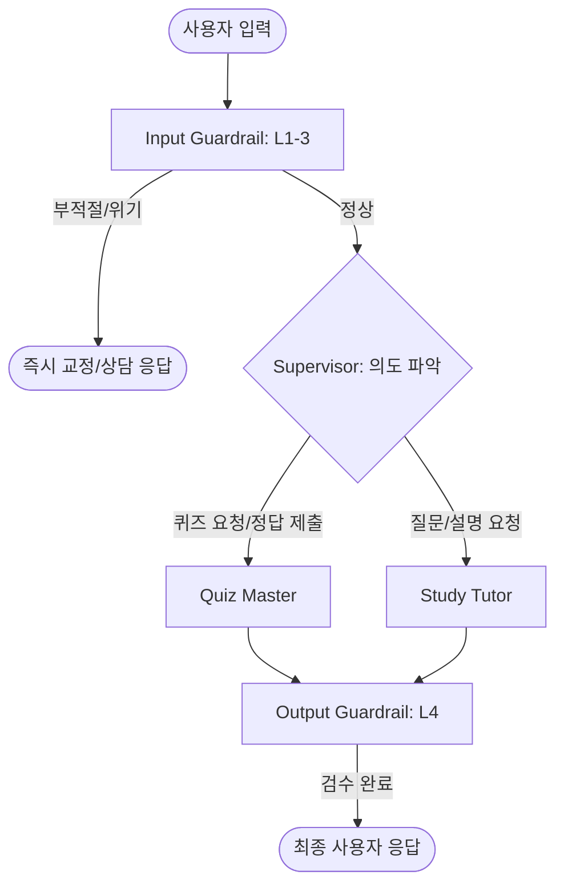

# 🛠️ 멀티 에이전트 시스템 전환 구현 계획서

이 문서는 단일 에이전트 기반의 LangChain Quiz Chatbot을 LangGraph 기반의 멀티 에이전트 아키텍처로 전환하기 위한 상세 계획을 정의합니다.

## 1. 목표 (Objectives)
- **에이전트 전문화**: 퀴즈 생성 및 평가와 일반 질의응답을 각각 전용 에이전트에게 할당하여 성능 최적화.
- **상태 관리 체계화**: LangGraph의 `StateGraph`를 통해 복잡한 세션 상태를 체계적으로 관리.
- **모듈화 완성**: `main.py`에 집중된 로직을 `src/` 하위 모듈로 분리하여 유지보수성 향상.

## 2. 변경된 시스템 아키텍처 (Revised Architecture)

### 2.1 에이전트 구성
| 에이전트 명칭 | 역할 | 주요 도구/프롬프트 |
| :--- | :--- | :--- |
| **Supervisor (라우터)** | 사용자 의도를 파악하여 퀴즈 또는 튜터 에이전트로 연결 | Intent Classifier Prompt |
| **Quiz Master** | PDF 기반 퀴즈 생성, 정답 채점, 해설 제공 | Quiz Prompt, Evaluator |
| **Study Tutor** | PDF 내용을 바탕으로 심층적인 설명 및 질문 답변 | RAG (Search Tools) |
| **Guardrail Node** | 입력 및 출력의 교육적 적합성 및 안전성 검토 | `src/guardrails.py` 연동 |

### 2.2 LangGraph 흐름도 (워크플로우)


> **구조 설명**: 
> 1. **Input Guardrail (Layer 1-3)**: 에이전트 호출 전 부정행위, 개인정보, 위험 상황을 선제적으로 차단합니다.
> 2. **Supervisor**: 안전한 입력에 한해 각 전문 에이전트로 작업을 배분합니다.
> 3. **Output Guardrail (Layer 4)**: AI 전문 답변이 나기 직전, 정답 유출 여부를 감시하여 필요 시 답변을 교정합니다.

## 3. 단계별 구현 로드맵 (Roadmap)

### Phase 1: 기반 구조 구축 및 모듈 분리
- [x] `src/core/state.py`: 그래프 상태(`AgentState`) 정의 (메시지, 현재 모드, 퀴즈 데이터 등)
- [x] `src/utils/ingestion.py`: PDF 로드 및 벡터스토어 관리 로직 분리
- [x] `src/utils/guardrails_wrapper.py`: 기존 `guardrails.py`를 그래프 노드 형식으로 래핑

### Phase 2: 에이전트 및 그래프 구현
- [x] `src/agents/quiz_agent.py`: 퀴즈 생성 로직을 독립적인 에이전트로 구현
- [x] `src/agents/tutor_agent.py`: RAG 기반 튜터 에이전트 구현
- [x] `src/agents/supervisor.py`: 사용자 의도(퀴즈 풀기 vs 질문하기)를 판단하고 라우팅하는 Supervisor 노드 구현
- [x] `src/workflow/graph_builder.py`: LangGraph를 이용하여 흐름도(Section 2.2)의 워크플로우 물리적 설계

### Phase 3: UI 연동 및 안정화
- [x] `main.py`: Streamlit과 LangGraph 연동 (Session State와 Graph State 동기화)
- [x] `docs/DEV_LOG.md`: 전환 과정에서 발생하는 문제 및 해결책 기록 (필수)
- [x] 성능 테스트: 퀴즈 정확도 및 RAG 답변 적합성 검증

## 4. 모듈 구조 정의
```text
src/
├── agents/             # 에이전트별 로직 (QuizMaster, Tutor 등)
├── core/               # 상태 정의 및 그래프 공통 설정
├── utils/              # PDF 처리, 가드레일, 헬퍼 함수
└── workflow/           # LangGraph 빌드 및 라우팅 로직
```

## 5. 준수 사항
- **Gemini 모델**: 반드시 무료 티어 모델을 사용하며, `gemini-2.5-flash` 또는 `gemini-3-flash` 사용을 권장합니다. (AGENTS.md 준수)
- **RAG 정합성**: 모든 전문 답변은 반드시 `search_pdf_documents` 검색 결과에 기반해야 합니다.
- **에러 기록**: 작업 중 발생하는 예외 상황은 반드시 `docs/DEV_LOG.md`에 [문제 정의] -> [해결책] 형식으로 문서화합니다.
